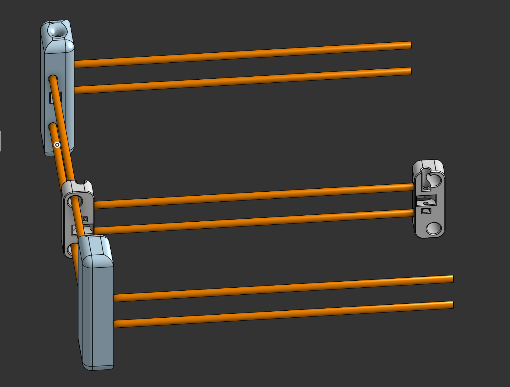
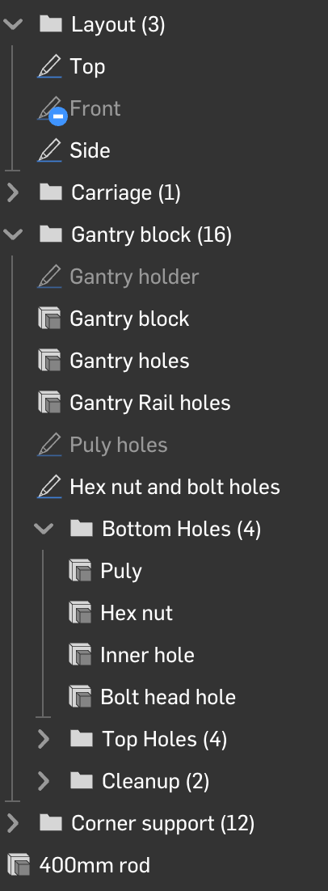

# 6 hrs so far - Update 1 6/29/2026 - around noon

I have stuff now! I cad'd 2 unique parts (seen in the assembly below). Side note: bolt holes are SO annoying. I've had to do at least 4-5 operations per bolt/pulley hole. At least I've gotten better at it

# Update 2 6/29/2026 - Evening

It's coming together! I've finished 3/4ths of the frame, just need to CAD the final block which will be the most complex as it houses the two steppers. Then I'll move on to the carriage & pen mover mechanism. 

Side note: CAD'ing this while maintaining good CAD practice has been quite difficult. On the bright side if I need to change anything it's all parametric and well named so it's easy to edit!

# Update 3 - 6/30/2026 - Morning

Think I've hit about 9 hours now. I finally finished the corner that has the motors mounted to it. Need to add the motors and bolts in but getting closer. Definitely my most complicated part yet with about sixteen operations to make it. Next up is to find a feature script for belts to show how they're routed

# 6/30/2026 - 2:10pm - It's belted!

After finding a feature script, I now have belts! Glad I CAD'd the belts because I found a few places it'd have to phase through so I carved out slots in the CAD! I also added the motors & pulleys on the motor shafts. Onto the gantry now!

# 6/30/2026 - 2:30pm - Belt bite

I noticed that the belts were getting too close to the carriage so I made belt bites!

# 7/1/2026 - 10:00pm - Stuff has arrived!

I've received all of the components I don't have (I'm canalizing a pen plotter named [Blot](https://github.com/hackclub/blot) that I got for free via a Hack Club program). I measured all the parts with some calipers and they all match what they said online! (this is good news because you never know when ordering stuff). Now to just finish up the gantry w/ tool head...

