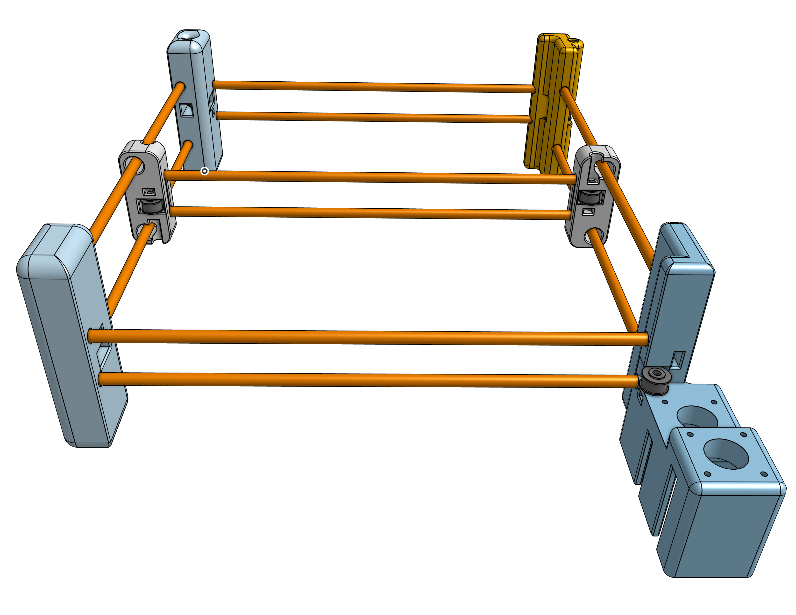

# Pen Plotter

This product is a Core XY pen plotter with an aim on being very fast and simple to assemble and transport.

Core XY is a motion system design that puts the motors that move the tool head stationary on the frame so that the tool head is lighter and can move faster.

CAD: https://cad.onshape.com/documents/8642f68c0cea6b6d6f4f58bc/w/37e52188ab44631161446060/e/7e3681aba0b666e61654ff5c?renderMode=0&uiState=6a433f53942e06713aab806e

_Progress as of the morning of 6/30/2026_

## Motivation:

I participated in a hack club program called [Blot](blot.hackclub.com). After using the pen plotter, I found it had some issues with not printing level and also speed. So I wanted to make a faster, larger pen plotter. For the electronics of this project, I'm mostly cannibalizing my blot hardware, but I will add a Raspbery PI for control over Wi-Fi.

## Firmware

See [`firmware/FIRMWARE_INSTRUCTIONS.md`](firmware/FIRMWARE_INSTRUCTIONS.md) for flashing, layout selection, and tuning.

Firmware is [samdev-7/upgraded-blot](https://github.com/samdev-7/upgraded-blot), slightly modified for a selectable CoreXY belt layout.