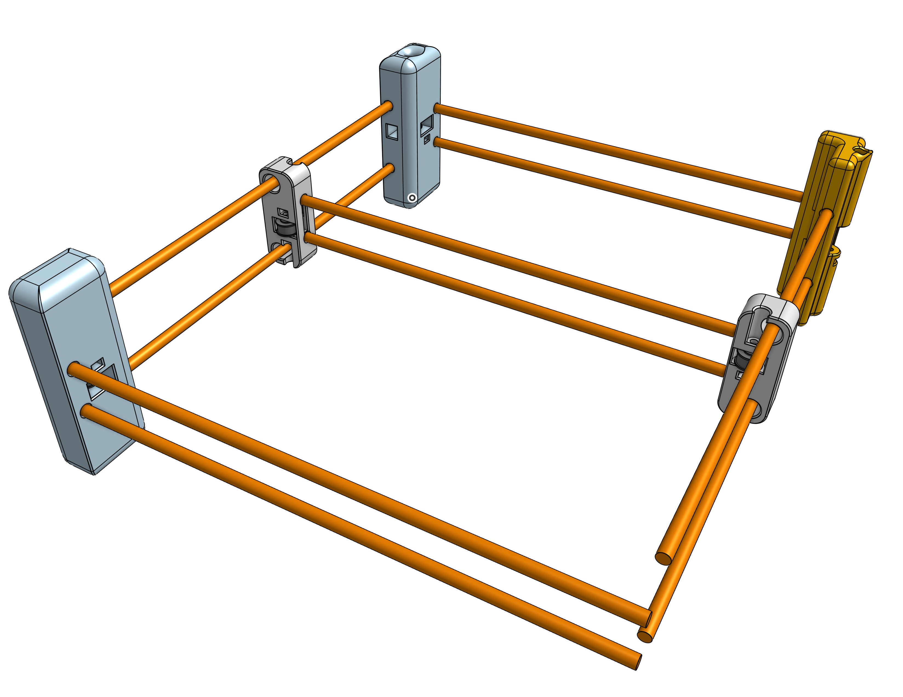

# Pen Plotter

This product is a Core XY pen plotter with an aim on being very fast and simple to assemble and transport.

Core XY is a motion system design that puts the motors that move the tool head stationary on the frame so that the tool head is lighter and can move faster.

CAD: https://cad.onshape.com/documents/8642f68c0cea6b6d6f4f58bc/w/37e52188ab44631161446060/e/7e3681aba0b666e61654ff5c?renderMode=0&uiState=6a433f53942e06713aab806e

_Progress as of the evening of 6/29/2026_